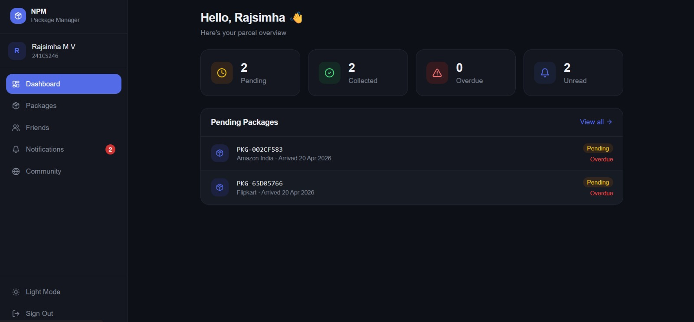
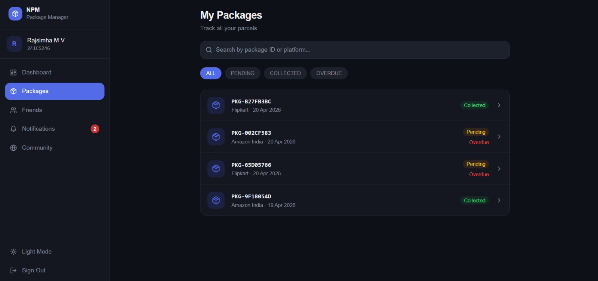
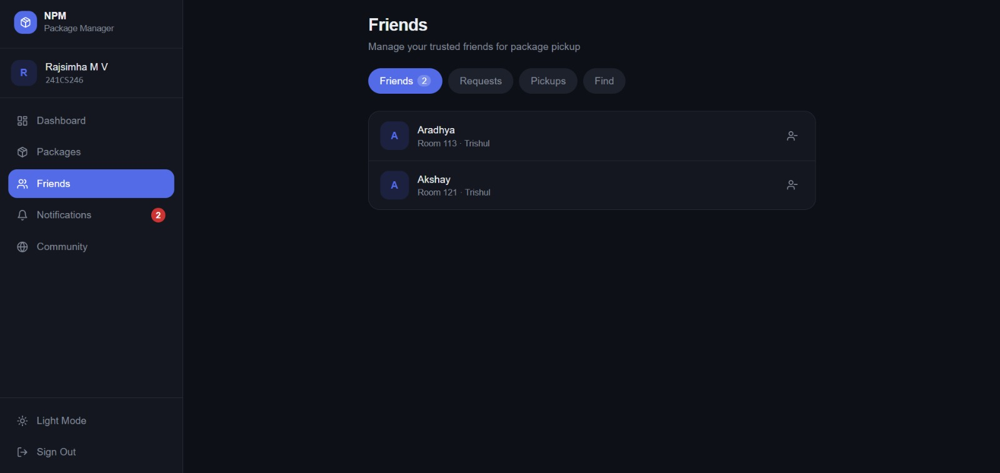
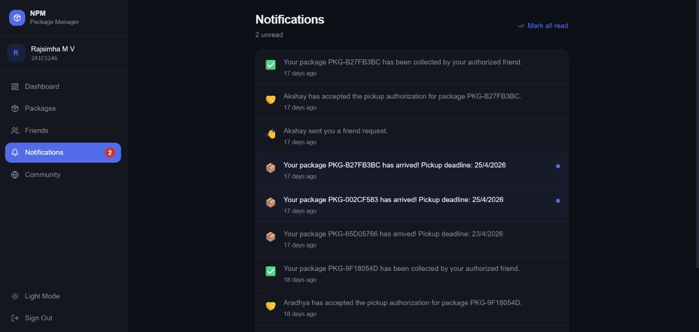
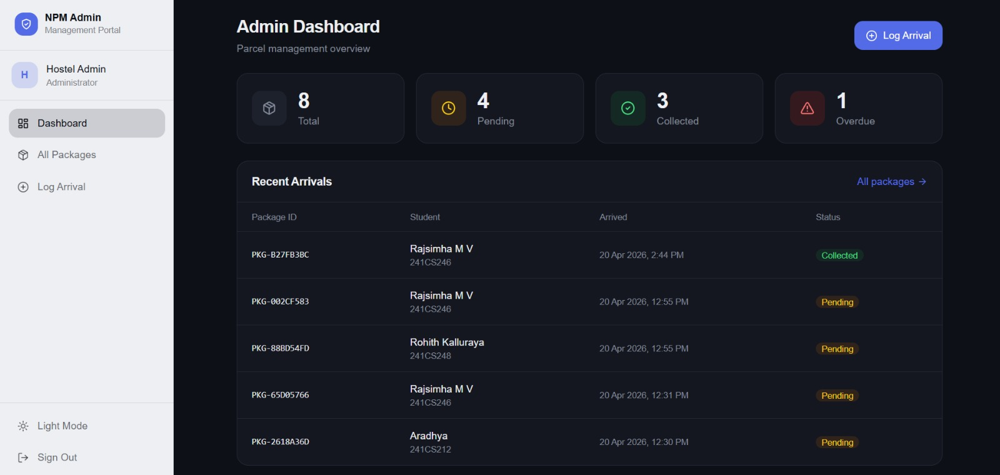
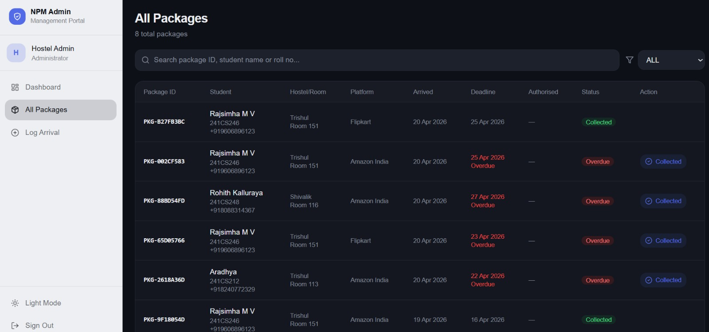
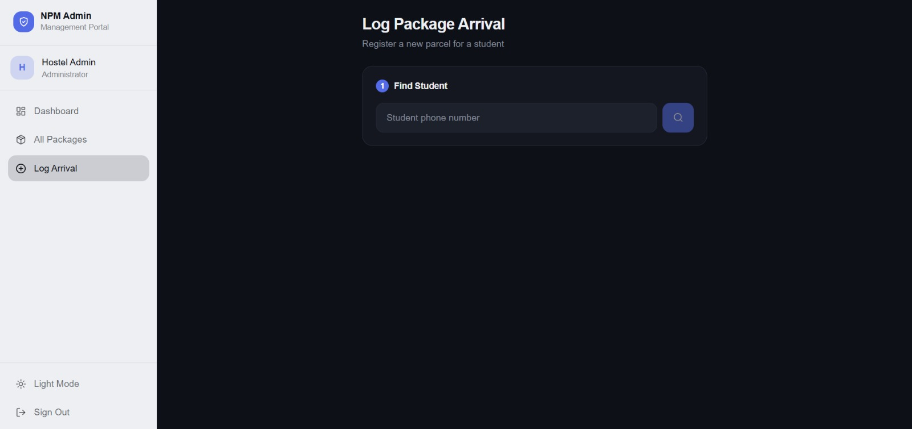

# NPM — NITK Package Manager

## Overview

NPM (NITK Package Manager) is a hostel parcel management system built for NITK Surathkal, developed using Node.js, Express, React, and MySQL (via Prisma ORM). It allows hostel administrators to log incoming packages, notifies students when their parcels arrive, and enables students to authorize friends to collect deliveries on their behalf.

---

## Project Structure

```
npm-project/
├── backend/          # Node.js + Express + Prisma API
└── frontend/         # React + Tailwind CSS UI
```

---

## Backend Setup

### Prerequisites
- Node.js v18+
- MySQL 8+

### Steps

```bash
cd backend

# Install dependencies
npm install

# Copy and configure environment
cp .env.example .env
# Edit .env with your DB credentials and Twilio keys

# Run DB migrations
npx prisma migrate dev --name init

# Generate Prisma client
npx prisma generate

# (Optional) Seed platforms
npx prisma studio   # to manually add hostels and platforms

# Start dev server
npm run dev
```

The server runs on `http://localhost:5000`.

### Seeding Initial Data

After migration, create at least one Admin and some Hostels using Prisma Studio or direct SQL:

```sql
-- Example hostel
INSERT INTO hostels (name, address) VALUES ('Hostel 1', 'NITK Campus, Surathkal');
INSERT INTO hostels (name, address) VALUES ('Hostel 2', 'NITK Campus, Surathkal');

-- Example ecommerce platforms
INSERT INTO ecommerce_platforms VALUES ('AMAZON', 'Amazon India', 'Mangalore Warehouse');
INSERT INTO ecommerce_platforms VALUES ('FLIPKART', 'Flipkart', 'Bangalore FC');
INSERT INTO ecommerce_platforms VALUES ('MEESHO', 'Meesho', 'Various');

-- Example admin (password: admin123 — bcrypt hash below)
-- Generate hash: node -e "const b=require('bcryptjs');b.hash('admin123',12).then(console.log)"
INSERT INTO admins (name, phone, password_hash) VALUES ('Admin', '+919999999999', '<bcrypt_hash>');
```

---

## Frontend Setup

### Prerequisites
- Node.js v18+

### Steps

```bash
cd frontend

# Install dependencies
npm install

# Copy environment
cp .env.example .env
# REACT_APP_API_URL=http://localhost:5000/api

# Start dev server
npm start
```

The app runs on `http://localhost:3000`.

---

## File Naming Convention

| Type        | Pattern                         |
|-------------|----------------------------------|
| Routes      | `name.routes.js`                |
| Controllers | `name.controller.js`            |
| Middleware  | `name.middleware.js`            |
| Utilities   | `name.utils.js`                 |
| Config      | `name.config.js`                |

---

## API Endpoints Summary

### Auth
- `POST /api/auth/student/login`
- `POST /api/auth/student/register`
- `POST /api/auth/student/verify-otp`
- `POST /api/auth/student/resend-otp`
- `POST /api/auth/admin/login`

### Student
- `GET /api/students/profile`
- `GET /api/students/hostels`
- `GET /api/students/dashboard-stats`

### Packages
- `GET /api/packages/my`
- `GET /api/packages/detail/:id`
- `POST /api/packages/log` *(admin)*
- `GET /api/packages/admin/all` *(admin)*
- `GET /api/packages/admin/stats` *(admin)*
- `PATCH /api/packages/admin/:id/collect` *(admin)*

### Friends
- `GET /api/friends/search`
- `GET /api/friends/list`
- `GET /api/friends/requests/pending`
- `POST /api/friends/request`
- `PATCH /api/friends/request/:id`
- `DELETE /api/friends/:id`

### Pickup Auth
- `POST /api/pickup/authorize`
- `GET /api/pickup/list`
- `PATCH /api/pickup/respond/:id`
- `DELETE /api/pickup/revoke/:id`

### Notifications
- `GET /api/notifications`
- `GET /api/notifications/unread-count`
- `PATCH /api/notifications/mark-read`

### Admin
- `GET /api/admin/profile`
- `GET /api/admin/lookup-student`
- `GET /api/admin/platforms`
- `POST /api/admin/platforms`

### Community
- `GET /api/community/friends-packages-today`
- `POST /api/community/opt-in`

---

## Tech Stack

| Layer | Technologies |
|---|---|
| Backend | Node.js, Express.js, Prisma ORM, MySQL, JWT, Twilio, node-cron |
| Frontend | React 18, React Router v6, Tailwind CSS, Axios, Lucide React, date-fns |

---

## Website Screenshots

### User Side

| Student Dashboard | Package Page |
|---|---|
|  |  |

| Friends Page | Notifications Page |
|---|---|
|  |  |

### Admin Side

| Admin Dashboard | All Packages Table |
|---|---|
|  |  |

| Admin Interface for logging parcels |
|---|
|  |

---

## Team
- Aradhya Mohapatra — 241CS212
- Rajsimha MV — 241CS246
- Rohith Kalluraya K — 241CS248
- Srikarthik Sankarkumar — 241CS260